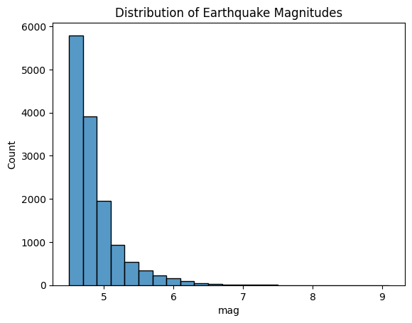
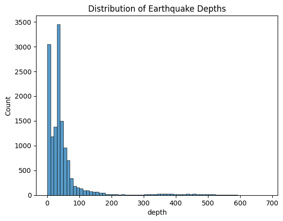
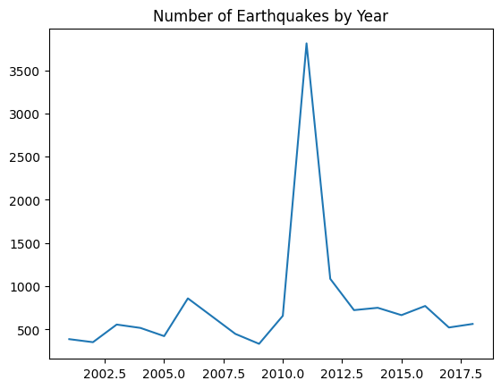
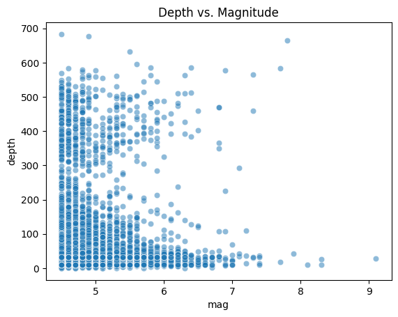
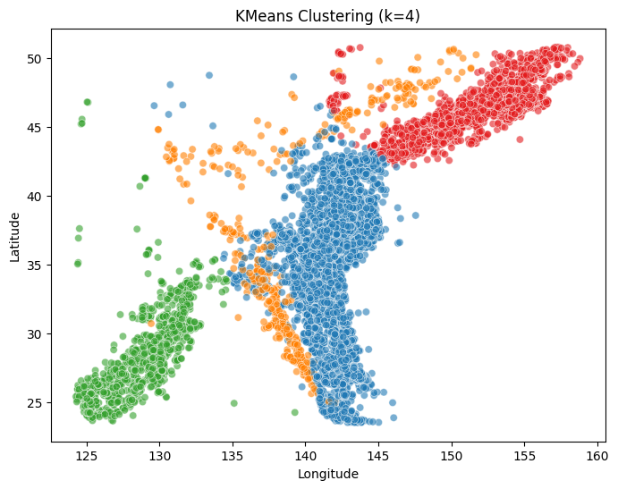
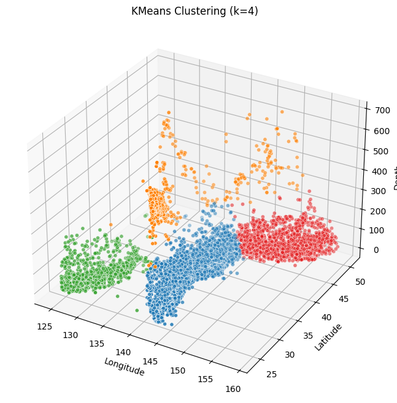

# Seismic Insight Machine Learning

## Overview

This project explores **21,000+ historical earthquakes in and around Japan** to uncover
spatial and temporal patterns relevant to disaster‑prevention research.

- Cleaned and enriched raw USGS data (datetime parsing and missing‑value handling).
- Performed exploratory data analysis (magnitude, depth, yearly trend).
- Applied **K‑Means clustering** (k = 4) to reveal seismic zones that align with Japan’s four major tectonic plates.
- Built an **interactive Folium map** of high‑magnitude events (M ≥ 6).

## Results

| Figure                                   | Insight                                 |
| ---------------------------------------- | --------------------------------------- |
|      | Magnitudes are right‑skewed.            |
|    | Most quakes are shallow ( &lt; 100 km). |
|      | Year‑by‑year trend in event counts.     |
|  | No clear depth–magnitude correlation.   |
|         | Feature‑correlation heatmap.            |
|     | K‑Means clusters (2‑D).                 |
|     | K‑Means clusters (3‑D).                 |

For a full interactive report, visit the **[GitHub Pages site](https://katsukii.github.io/earthquake-ml-project/)**.

## Dataset

[Earthquakes in Japan – Kaggle](https://www.kaggle.com/datasets/aerodinamicc/earthquakes-in-japan)  

## Tech Stack

Python · pandas · scikit‑learn · seaborn · matplotlib · Folium
